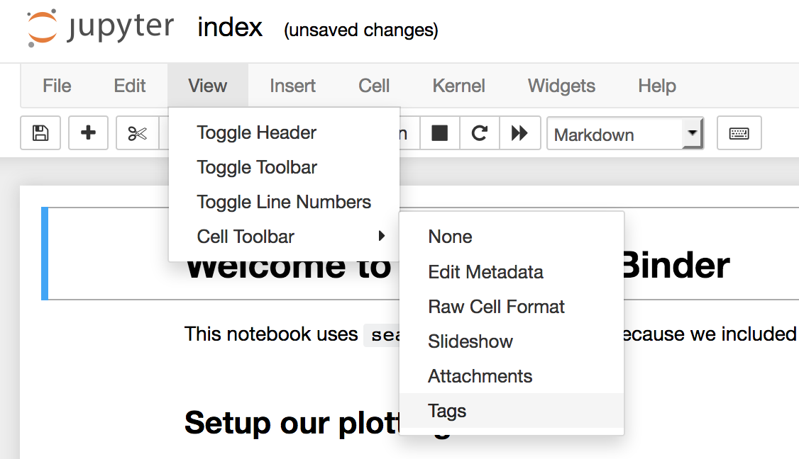

## Overview

This project item requires some initial configuration of conda environments in order to work correctly.

In the context of this project item there are two classes of environment:
    
1. Base environment: The base env is the conda environment from where the toolbox is launched. 

   This environment along with having the usual dependencies, now requires the 
   [nb_conda_kernels](https://github.com/Anaconda-Platform/nb_conda_kernels). <br>
   This package allows the base env to discover kernels that have been configured to run Jupyter notebooks. <br>
   This enables the user to configure environments per notebook they would like to execute.
   

2. Notebook environment:  A notebook env is configured with the desired packages required by a notebook in their workflow.
    
   To make a notebook env discoverable to the base env some setup is required. The notebook env requires ipykernel, 
   with ipykernel installed the kernelspec for the env needs to be installed, this allows the base env to discover it. <br>
   For installing the kernel spec see 
   [Kernels for different environments](https://ipython.readthedocs.io/en/stable/install/kernel_install.html). 
   With ipykernel and the kernelspec installed the user should install the packages required by the notebook.
   
### Example env setup
Below is an example of the steps required to setup both the base (toolbox) env and the notebook env.

With Anaconda Prompt or equivalent terminal open.
##### toolbox env setup

> conda activate toolbox_env
> 
> conda install nb_conda_kernels

#### notebook env setup
> conda create test_env
> 
> conda activate test_env
> 
> conda install ipykernel
> 
> python -m ipykernel install --user --name test_env --display-name "Python (test_env)"
   
The test_env will now be available to select from the notebook specification editor kernel select drop down menu. <br>
The **--display-name** argument determines what is shown in the dropdown menu, so for the above env **Python (test_env)** <br>
will be listed. 

#### Discovering kernels on backend
To discover installed kernel specs and add them to the drop down menu in the notebook specification editor <br>
the notebook item uses **jupyter_client.kernelspec.KernelSpec** and **jupyter_client.kernelspec.KernelSpecManager** <br>
see [kernelspec - discovering kernels](https://jupyter-client.readthedocs.io/en/stable/api/kernelspec.html). 

In [notebook_specification_editor_window.py](https://github.com/Spine-project/spine-items/blob/issue_1185_jupyter_notebook/spine_items/notebook/widgets/notebook_specification_editor_window.py)
kernels are discovered and added to the dropdown menu using the method **populate_available_kernel_list**. 

```python
    def populate_available_kernel_list(self):
        ksm = KernelSpecManager()
        specs = ksm.find_kernel_specs()
        available_kernels = list()
        for k_name, k_path in specs.items():
            available_kernels.append(k_name)
        return available_kernels
```


### Configure Jupyter notebook for execution
For passing resources to the notebook at runtime, the notebook requires cell tags to be enabled, and a cell defined <br> 
with the **parameters** tag. See image below to enable cell tags in Jupyter.



Now add the **parameters** tag to the first cell in the notebook, this allows the notebook to be parameterized. <br>
See [parameterize papermill](https://papermill.readthedocs.io/en/latest/usage-parameterize.html).

In the notebook specification editor add the input/output variables that have been added to the parameters cell. <br> 


    
    
    
                    